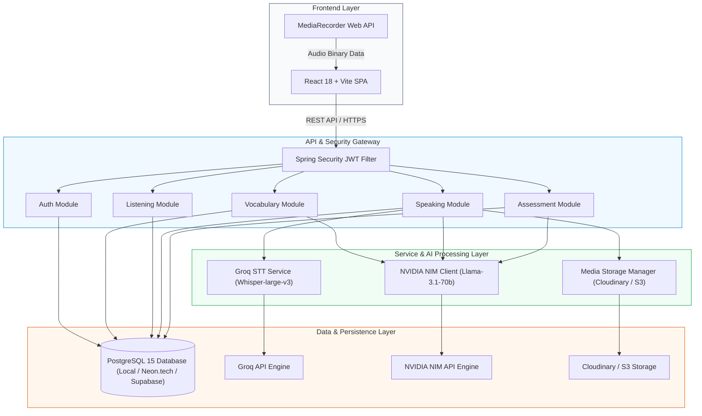
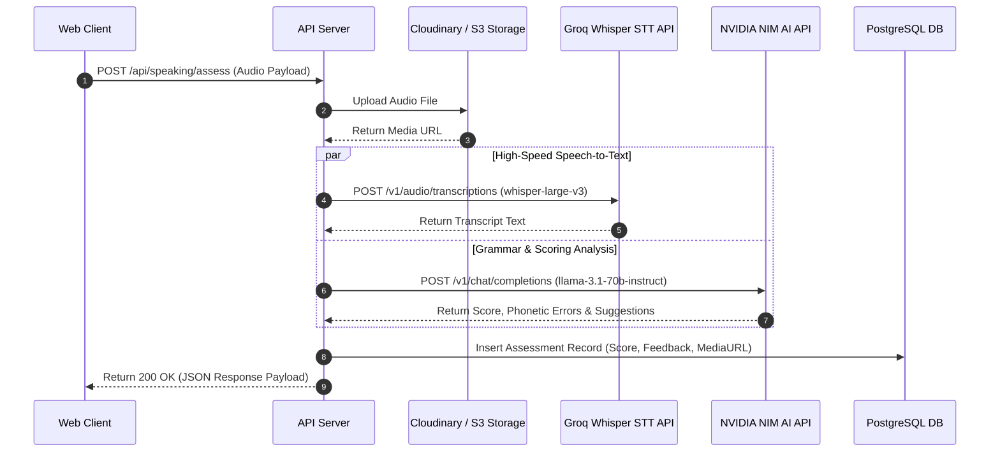
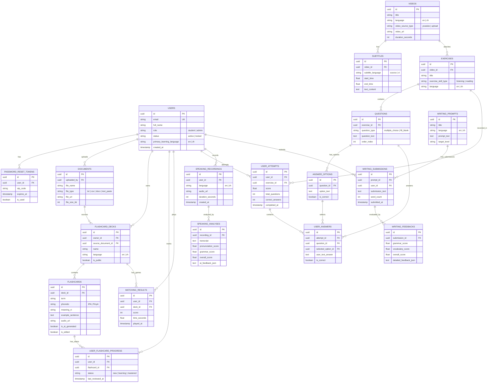

# Multilingual E-Learning Platform Engine

Nền tảng học ngoại ngữ song ngữ (English / Chinese) tích hợp trí tuệ nhân tạo (Groq Whisper STT + NVIDIA NIM Llama 3.1 AI Engine).

🔗 **Live Application Demo**: [https://learningenglish.id.vn](https://learningenglish.id.vn/)

---

## Architecture Blueprint



---

## Technical Specifications

| Module | Scope | Stack & Components |
|---|---|---|
| **Authentication & Authorization** | Token management, RBAC enforcement | Spring Security, JWT Bearer Tokens, BCrypt Hashing |
| **Vocabulary & AI Flashcards** | File parsing (.txt, .docx), automated extraction of IPA/Pinyin, translation and example generation | NVIDIA NIM (Llama 3.1 70B), SRS Algorithm, Word Match Game Engine |
| **Listening Module** | Interactive video player with bilingual timestamped subtitles and word lookup | HTML5 Media API, Subtitle Sync Engine |
| **Speaking Module** | Audio recording, high-speed speech-to-text conversion, real-time phonetic and grammar validation | MediaRecorder API, Groq Whisper STT (`whisper-large-v3`), NVIDIA NIM Llama 3.1 |
| **Reading & Writing Assessment** | Contextual reading comprehension and automated essay evaluation | Automated Essay Scoring (AES) via NVIDIA NIM API |
| **Analytics & History** | Persistence of assessment records, progress metrics, and flashcard mastery status | PostgreSQL Relational Database, Audit Logging |

---

## Execution Flow (Speaking Assessment Sequence)



---

## Complete Entity Relationship Schema (19 Tables)



---

## Technical Stack & Infrastructure

* **Frontend**: React 18, TypeScript, Vite, TailwindCSS, Axios
* **Backend**: Java 17, Spring Boot 3.x, Spring Security, Spring Data JPA
* **Database**: PostgreSQL 15 (Local PostgreSQL / Neon.tech / Supabase)
* **Speech-to-Text AI**: Groq API (`whisper-large-v3`)
* **Text AI / Analysis Engine**: NVIDIA NIM API (`meta/llama-3.1-70b-instruct`)
* **Media Storage**: Cloudinary / AWS S3
* **Containerization & Registry**: Docker, Docker Hub (`hoangmelinh/elearning-backend`, `hoangmelinh/elearning-frontend`)

---

## Setup & Deployment Guide

### Option 1: Local Development Environment

Sử dụng `docker-compose.yml` để chạy môi trường phát triển cục bộ với PostgreSQL container:

```bash
# Di chuyển vào thư mục dự án
cd website_elearning

# Khởi chạy các container cho môi trường Dev
docker-compose up -d
```

---

### Option 2: Production Deployment Environment (AWS EC2)

Dự án sử dụng GitHub Actions CI/CD (`.github/workflows/ci-cd.yml`) tự động đóng gói Docker Images đẩy lên Docker Hub và deploy tự động tới máy chủ **AWS EC2**:

```bash
# Triển khai thủ công trên server EC2
docker-compose -f docker-compose.prod.yml up -d
```

---

## Default Endpoints
* **Production Live Web App**: [https://learningenglish.id.vn](https://learningenglish.id.vn/)
* **Local Development Web App**: `http://localhost` (Cổng 80)
* **Backend REST Services**: `http://localhost:8081` (Cổng 8081)

---

## Preview Diagrams in VS Code

Mở file `README.md` và nhấn phím tắt:
* **`Ctrl + Shift + V`** hoặc **`Ctrl + K V`** (xem trước sơ đồ trực quan).
